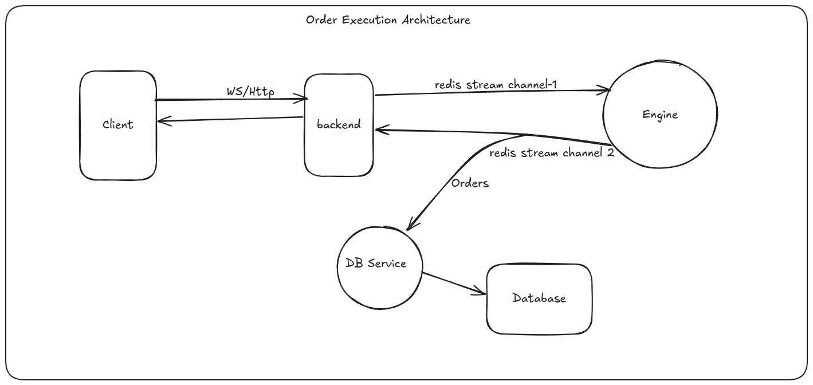

# Order Execution Engine

A microservices-based order execution system that processes market orders with DEX routing and real-time WebSocket updates.

## Documentation

**[GitHub Documentation](https://github.com/your-username/order-execution-engine/blob/main/docs/README.md)** - Detailed technical documentation including design decisions, architecture patterns, and implementation details.

## Architecture



This system consists of 4 services working together:

- **[Backend](./backend/README.md)** - WebSocket API for order submission and status updates
- **[Mock DEX Router](./mock_dex_router/README.md)** - Processes orders and simulates DEX interactions
- **[Database Service](./db-service/README.md)** - Stores final order results in PostgreSQL
- **[Tester](./tester/README.md)** - Node.js service for test.
- **Infrastructure** - PostgreSQL database and Redis message broker


## Order Types

**Market Orders** - Execute immediately at current market price

I chose market orders because they are the most common and straightforward to implement. The same engine can be extended to support other types:

Limit Orders: Add price monitoring and maintain an order book (array) to store and track orders until the target price is reached.

Sniper Orders: Detect new token launches and execute trades instantly using automated event monitoring, with a dedicated processing stream for maximum speed.

## Design Decisions

**Redis Streams** - Used for sending and receiving data between services through streams channels. Provides reliable message delivery and enables real-time status updates and persistance storage.
- **Backend** - Publishes orders to Redis streams and listens for status updates
- **Mock DEX Router** - Consumes orders from streams and publishes status updates
- **Database Service** - Monitors streams for final order statuses

**Rust** - Chosen for fast and asynchronous processing. Offers memory safety, high performance, and excellent concurrency support for handling multiple orders simultaneously.
- **Backend** - WebSocket API server with Axum framework
- **Mock DEX Router** - Order processing and DEX simulation
- **Database Service** - Redis monitoring and PostgreSQL storage

**Diesel ORM** - Used for database storage operations. Provides type-safe database interactions with compile-time query validation and efficient PostgreSQL integration.
- **Database Service** - Handles all PostgreSQL operations and schema migrations

## Quick Start

```bash
docker compose up 
```

The system will be available at `http://localhost:3000`

## Order Flow

1. **Order Submission**: User submits order via POST `/api/orders/execute` with JSON payload
2. **WebSocket Connection**: User connects to WebSocket at `/api/orders/status` and sends order ID
3. **Order Validation**: Backend validates order parameters and slippage tolerance
4. **Order Processing**: Mock DEX router processes the order through Redis streams
5. **Real-time Updates**: Status updates sent via WebSocket (pending → routing → building → submitted → confirmed/failed)
6. **Database Storage**: Final order results stored in PostgreSQL via database service

## API Design

The system uses a two-step approach for order submission and real-time updates:

1. **POST Request**: Client sends order data via HTTP POST to `/api/orders/execute`
2. **WebSocket Connection**: Client connects to WebSocket at `/api/orders/execute` and sends the order ID as plain text
3. **Real-time Updates**: Client receives status updates via WebSocket connection

This approach separates order submission (HTTP) from status monitoring (WebSocket) for better reliability and easier client implementation. The WebSocket connection is registered by sending the order ID as a plain text message (not JSON).

### WebSocket Connection Process
The test suite demonstrates the complete HTTP-to-WebSocket upgrade process:
- HTTP POST order submission with detailed response logging
- HTTP GET upgrade request with WebSocket key generation
- WebSocket connection establishment and order ID registration
- Real-time status update monitoring with comprehensive logging

## Status Updates

Orders progress through these states:
- `pending` - Order received
- `routing` - Comparing DEX prices  
- `building` - Creating transaction
- `submitted` - Transaction sent
- `confirmed` - Success (includes txHash and execution price)
- `failed` - Error occurred (includes reason)

## Services

### Backend Service
Handles order submission and WebSocket connections. Validates orders and streams status updates to users.

### Mock DEX Router  
Simulates Raydium and Meteora DEX interactions. Compares prices, handles slippage protection, and executes swaps with realistic delays.

### Database Service
Monitors Redis for final order statuses and stores confirmed/failed orders in PostgreSQL for persistence.

## Tech Stack

- **Rust** - All services written in Rust for performance and memory safety
- **Axum** - Web framework for backend
- **Redis** - Message streaming between services
- **PostgreSQL** - Order persistence
- **Docker** - Containerization

## Design Decisions

### Technology Choices

**Rust for Backend Services**
- **Performance**: Rust provides near C-level performance with memory safety
- **Concurrency**: Excellent async/await support for handling multiple orders simultaneously
- **Reliability**: Compile-time guarantees prevent runtime errors in financial operations
- **Ecosystem**: Growing web framework ecosystem with Axum for high-performance HTTP servers

**Redis Streams for Inter-Service Communication**
- **Reliability**: Streams provide guaranteed message delivery and persistence
- **Scalability**: Multiple consumers can process messages without losing data
- **Order Processing**: Perfect for order lifecycle management with status updates
- **Real-time**: Enables real-time status broadcasting to WebSocket clients

**Diesel ORM for Database Operations**
- **Type Safety**: Compile-time SQL query validation prevents runtime database errors
- **Performance**: Zero-cost abstractions with direct SQL generation
- **Migration Management**: Built-in schema migrations for database evolution
- **PostgreSQL Integration**: Native support for advanced PostgreSQL features

**WebSocket for Real-time Updates**
- **Low Latency**: Direct connection for instant status updates
- **Bidirectional**: Allows client registration and server push notifications
- **HTTP Upgrade**: Seamless upgrade from HTTP POST to WebSocket connection
- **Connection Management**: Efficient handling of multiple concurrent connections

### Architecture Patterns

**Microservices Architecture**
- **Separation of Concerns**: Each service handles specific domain logic
- **Independent Deployment**: Services can be updated and scaled independently
- **Fault Isolation**: Failure in one service doesn't affect others
- **Technology Flexibility**: Each service can use optimal technology stack

**Event-Driven Communication**
- **Loose Coupling**: Services communicate through events rather than direct calls
- **Asynchronous Processing**: Non-blocking message passing between services
- **Scalability**: Easy to add new consumers or modify processing logic
- **Audit Trail**: All events are logged for debugging and compliance

## Testing

### Comprehensive Test Suite
The system includes a comprehensive test suite with acknowledgment handling and detailed WebSocket connection logging:

```bash
cd tests
npm install

# Run all tests
node test-runner.js

# Run specific test suites
node acknowledgment-tests.js 
node integration-tests.js 
```

### Test Features
- **HTTP POST Order Submission**: Validates order creation and response handling
- **WebSocket Connection Upgrades**: Tests HTTP GET upgrade to WebSocket connections
- **Real-time Status Tracking**: Monitors complete order lifecycle (pending → routing → building → submitted → confirmed)
- **Concurrent Order Processing**: Tests multiple simultaneous orders
- **Error Handling**: Validates timeout scenarios and failure recovery
- **Comprehensive Logging**: Detailed visibility into HTTP-to-WebSocket upgrade process

### Test Coverage
- Single order acknowledgment tests
- Concurrent order processing (3+ orders)
- WebSocket connection and reconnection
- Slippage validation testing
- Error handling and timeout scenarios
- Complete order lifecycle validation

### Manual API Usage
```bash
# Step 1: Submit order via POST
curl -X POST http://localhost:3000/api/orders/execute \
  -H "Content-Type: application/json" \
  -d '{
    "token_in": "SOL",
    "token_out": "USDC", 
    "amount": 12.5,
    "order_type": "market",
    "max_slippage": 0.05
  }'

# Response: {"order_id": "uuid-string"}

# Step 2: Connect to WebSocket and send order ID as plain text
wscat -c ws://localhost:3000/api/orders/execute or you can use get request with upgrade related headers
# Then send the order ID (not JSON, just the UUID string)
```

### Running Tests
```bash
# Run comprehensive test suite
cd tests && node test-runner.js

# Individual test suites
node acknowledgment-tests.js    # Acknowledgment and timeout tests
node integration-tests.js       # Full integration and lifecycle tests
```

### Example WebSocket Messages
You'll receive real-time status updates like:
```json
{"order_id": "uuid", "status": "pending", "execution_price": null, "tx_hash": null}
{"order_id": "uuid", "status": "routing", "execution_price": null, "tx_hash": null}
{"order_id": "uuid", "status": "building", "execution_price": null, "tx_hash": null}
{"order_id": "uuid", "status": "submitted", "execution_price": null, "tx_hash": "0x..."}
{"order_id": "uuid", "status": "confirmed", "execution_price": 218.06, "tx_hash": "0x..."}
```

## Performance

- Processes up to 10 concurrent orders
- Handles 100+ orders per minute
- 2-3 second execution time per order
- Real-time WebSocket updates

**Solution**: Use separate endpoints:
- POST `/api/orders/execute` for order submission
- GET `/api/orders/status` for WebSocket connection

## Development

Each service has its own README with detailed setup instructions. See the individual service directories for more information.
